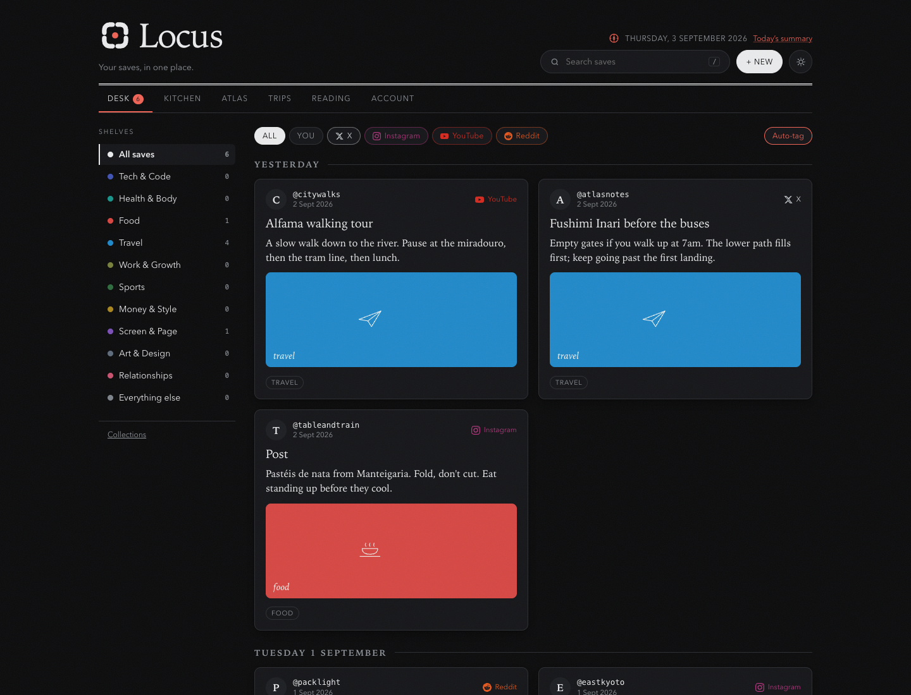
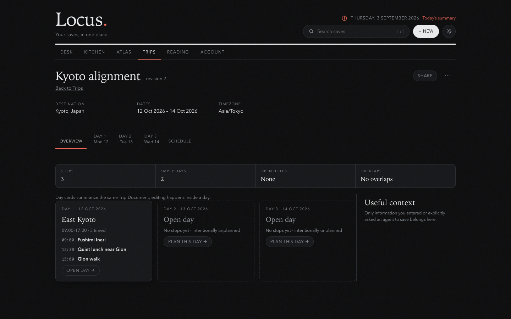
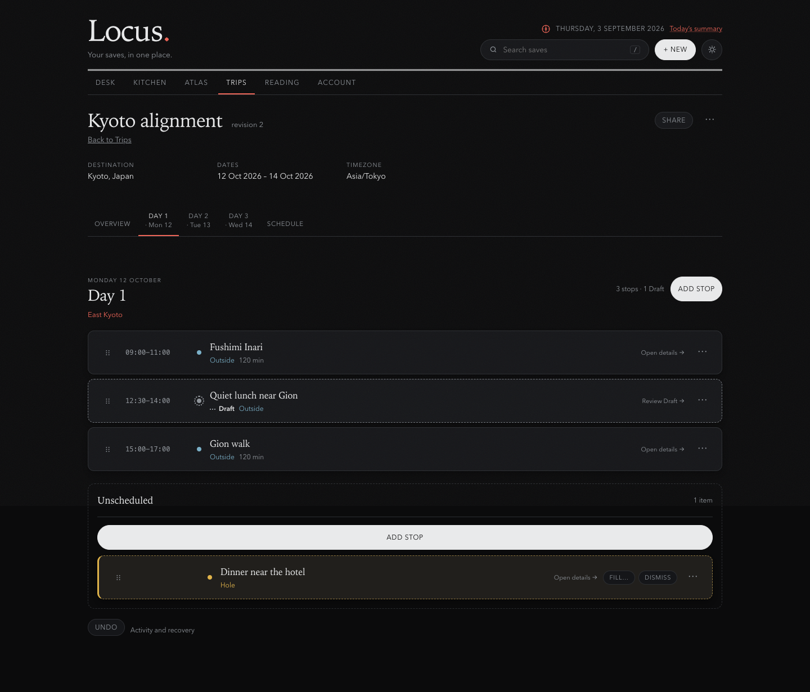

<p align="center">
  
</p>

# Locus

Private desk for things you already saved. A browser agent can work on the open page through page-defined [WebMCP](https://webmachinelearning.github.io/webmcp/) tools; you keep control of drafts, recommendations, and consequential changes.

**Live:** [locus-identity-staging.abhigyan0987.workers.dev](https://locus-identity-staging.abhigyan0987.workers.dev) — Google sign-in. Registration stays open through 21 September 2026, 5:00 pm PDT.

<p align="center">
  
</p>

<p align="center">
  
</p>

<p align="center">
  
</p>

Saves from X, Instagram, YouTube, Reddit, or a URL you paste become Items in your Library. The same Item can be something to read, a dish to cook, a Place, or a stop on a Trip. Locus is not affiliated with those platforms. Capture reads *your* saves in *your* browser; it is optional. Judges can sign in, paste public URLs, and use WebMCP without connecting a social account or installing the extension.

## WebMCP

Each private surface registers tools with `document.modelContext.registerTool` while that page is visible, and removes them on navigate away:

| Page | Adapter |
| --- | --- |
| Reading | [`app/src/reading-webmcp.ts`](app/src/reading-webmcp.ts) |
| Kitchen | [`app/src/kitchen-recipe-webmcp.ts`](app/src/kitchen-recipe-webmcp.ts), [`app/src/kitchen-tonight-webmcp.ts`](app/src/kitchen-tonight-webmcp.ts) |
| Intake | [`app/src/library-intake-webmcp.ts`](app/src/library-intake-webmcp.ts) |
| Trips | [`app/src/trips-webmcp.ts`](app/src/trips-webmcp.ts) |

Exact instructions can apply a revision-checked write. Open-ended taste questions present bounded options in the page and wait for you. Tools treat saved captions as untrusted content. Try the live app in [ChatGPT’s in-app browser](https://webmcp.devpost.com/) or Chrome 149+ with `chrome://flags/#enable-webmcp-testing`.

## Run locally

Node 22.5+ (uses `node:sqlite`).

```bash
npm install
npm test
npm run dev
```

Open http://127.0.0.1:8787. Data stays in `~/Library/Application Support/Locus/locus.db` (macOS), `%APPDATA%/Locus` (Windows), or `~/.local/share/Locus` (Linux). Keep one process on port 8787. More in [docs/BUILD.md](docs/BUILD.md).

Hosted edition: Cloudflare Worker + D1. Copy [`hosted/.dev.vars.example`](hosted/.dev.vars.example) to `hosted/.dev.vars`, then from `hosted/` run `npm install` and `npm run dev` (http://127.0.0.1:8791).

## Prior work

Before this challenge, Locus was a local-only desk: capture saves from X, Instagram, YouTube, and Reddit, keep them in a private SQLite library, and open them in-tab. Page-defined WebMCP tools and the hosted Cloudflare app were added during the challenge.

## License

[MIT](LICENSE). Third-party notices: [THIRD_PARTY_NOTICES.md](THIRD_PARTY_NOTICES.md).
